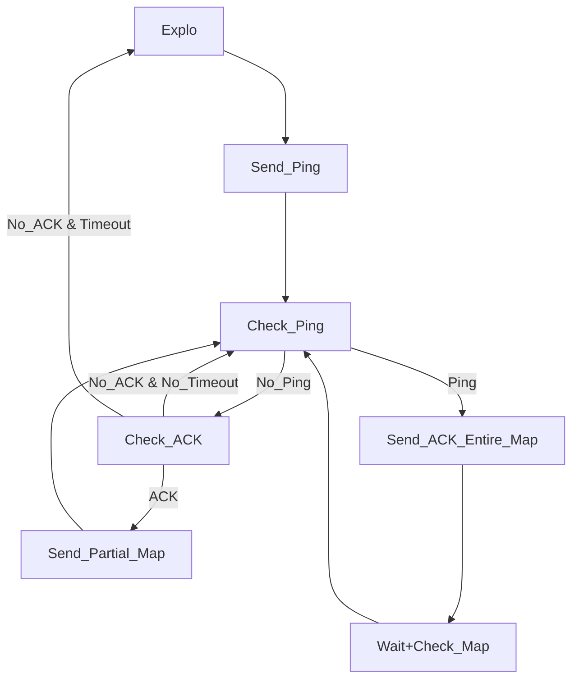
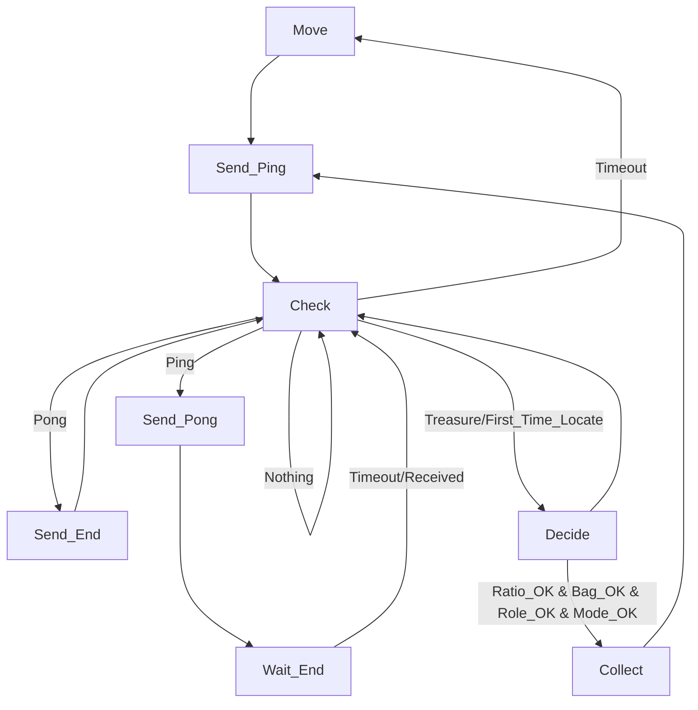
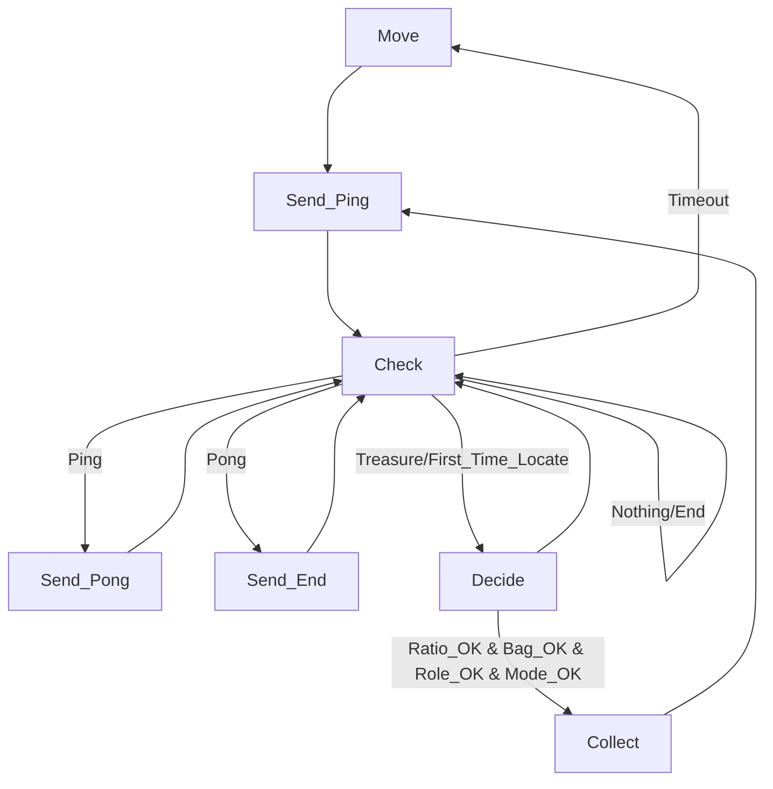

# le Explo Only

# Explo & Collect

# Enchere

## Move: 3 modes: 
### Explo
Explore / complete map
### Locate
Get all the known treasures
### Search
Look for unknown treasures

## Check: Manage order / priority
### Treasure
Pass to Treasure only one time

## Decide: decide roles and whether to collect
### Treasure & Value
### Bag
If bag is empty
### Mode
Maybe not a factor?
### Role 
If the role correspond
### Ratio
If the ratio permits me to become collector a said type
Type: 
TotalRatio : Proportion (TRatio)
Average Collected : Equity (ARatio)

~~No role & Locate -> Give role -> Check~~
No role & TRatio_OK & Bag>Value -> Collect
Role_OK & ARatio_OK & Bag>Value -> Collect 
BagFull -> SearchMode -> Check

# Enchere
W > L > E > S
## Explo - Explo / L-L / S-S
avoid going to the same node together

## Other (applicable for Wumpus)
Give space for L by changing the goal node
When colliding, one with less priority switch to next goal, when all goals cause collision, do random move
(extreme case: random)

