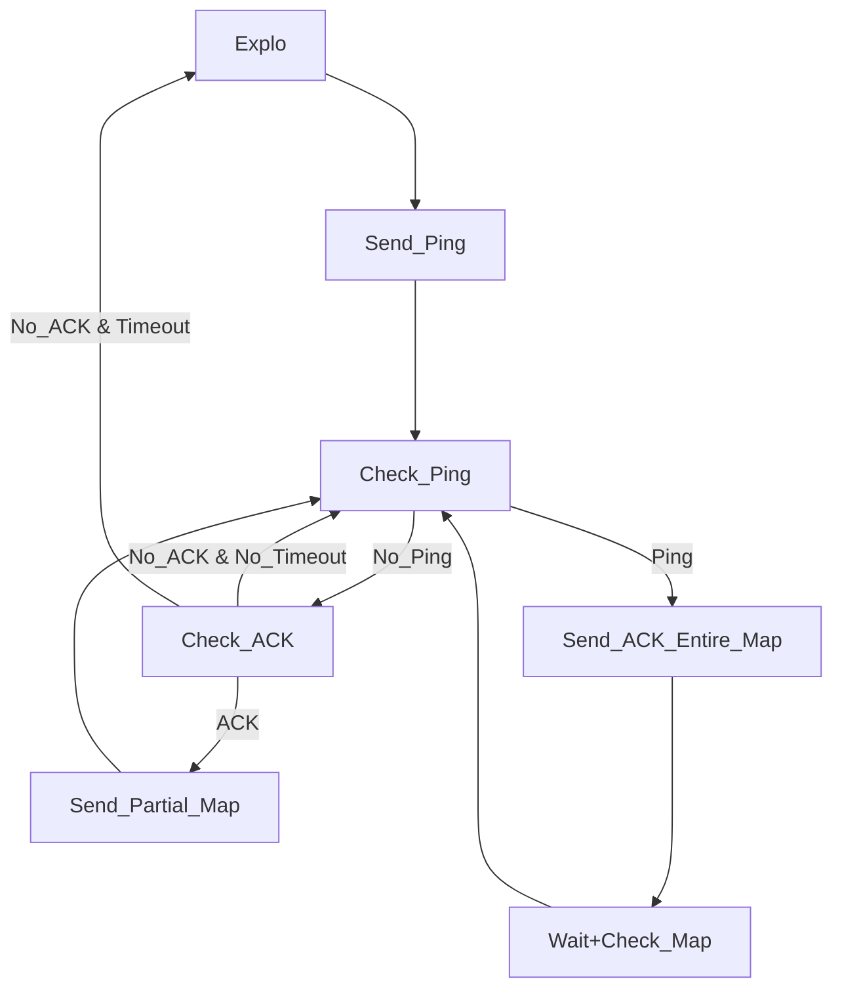
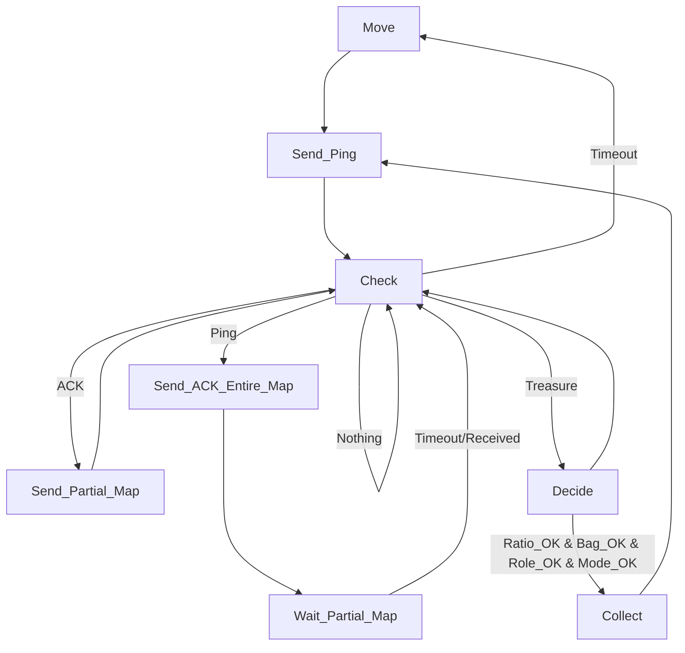

# le Explo Only

# Explo & Collect

## Move: 3 modes: 
### Explo
Explore / complete map
### Locate
Get all the known treasures
### Search
Look for unknown treasures

## Check: Manage order / priority
### Treasure
Pass to Treasure only one time

## Decide: 4 factors
### Bag
If bag is empty
### Mode
Maybe not a factor?
### Role 
If the role correspond
### Ratio
If the ratio permits me to become collector a said type
Global ratio is updated through the quantities of treasures on the map

